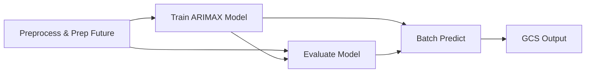

# Cashflow Batch Scoring Pipeline

An end-to-end MLOps pipeline built with **Kubeflow Pipelines (KFP)** and **Vertex AI** that trains an ARIMAX time-series model on Kaggle store sales data and generates batch cashflow forecasts delivered to Google Cloud Storage.

---

## Pipeline Overview

The pipeline aggregates daily store sales into a single cashflow time series, enriches it with exogenous signals (oil prices & holidays), trains a statsmodels ARIMAX model, evaluates it on a holdout set, and writes future forecasts to GCS.



### Pipeline Steps

| Step | Component | Description |
|------|-----------|-------------|
| 1 | **Preprocess & Prep Future** | Reads `train.csv`, `oil.csv`, and `holidays_events.csv` from GCS. Aggregates sales into daily cashflow, merges exogenous features (oil price, holiday flags, promotions), splits into train/test sets, and generates a future calendar for the forecast horizon. |
| 2 | **Train Model** | Fits an ARIMAX(7,1,1) model on the training split using `onpromotion`, `oil_price`, and `is_holiday` as exogenous variables. Serializes the fitted model as a Vertex AI Model artifact. |
| 3 | **Evaluate Model** | Loads the saved model, forecasts over the holdout test period, and logs MAE and RMSE metrics to the Vertex AI Metrics store. |
| 4 | **Batch Predict** | Loads the trained model, forecasts the true future using the prepared calendar, clamps predictions to non-negative values, and writes the results as a CSV to the configured GCS output path. |

### Output

The final forecast CSV is written to `gs://<BUCKET>/batch_predictions/latest_forecast.csv` and contains:

| Column | Description |
|--------|-------------|
| `date` | Forecast date |
| `predicted_cashflow` | Predicted daily cashflow (floored at 0) |
| `is_holiday` | Holiday flag for the date |
| `oil_price` | Oil price used as input |

---

## Prerequisites

- **Google Cloud Project** with the Vertex AI API enabled
- **GCS Bucket** containing the Kaggle [Store Sales](https://www.kaggle.com/competitions/store-sales-time-series-forecasting) dataset files:
  - `train.csv`
  - `oil.csv`
  - `holidays_events.csv`
- **Python 3.10+**
- Authenticated `gcloud` CLI (`gcloud auth application-default login`)

---

## Setup

1. **Clone the repo and navigate to the pipeline directory:**

   ```bash
   cd direct_pipeline
   ```

2. **Create a virtual environment and install dependencies:**

   ```bash
   python -m venv .venv
   source .venv/bin/activate
   pip install -r requirements.txt
   ```

3. **Update the configuration** at the top of `mlops.py`:

   ```python
   PROJECT_ID = "your-gcp-project-id"
   LOCATION   = "your-gcp-region"        # e.g. "asia-southeast2"
   BUCKET_URI = "gs://your-bucket-name"
   ```

4. **Upload your dataset to GCS** (if not already there):

   ```bash
   gsutil cp train.csv oil.csv holidays_events.csv gs://your-bucket-name/sales_forecast/
   ```

---

## Running the Pipeline

Submit the pipeline to Vertex AI Pipelines:

```bash
python mlops.py
```

This will:

1. **Compile** the KFP pipeline to `batch_pipeline.yaml`
2. **Initialize** the Vertex AI SDK with your project settings
3. **Submit** the pipeline job to Vertex AI

After submission, a link to the Vertex AI Pipelines dashboard will be printed to the console where you can monitor the run visually.

---

## Pipeline Parameters

All parameters have defaults and can be overridden in the `kaggle_pipeline()` function:

| Parameter | Default | Description |
|-----------|---------|-------------|
| `train_uri` | `gs://<BUCKET>/sales_forecast/train.csv` | GCS path to training data |
| `oil_uri` | `gs://<BUCKET>/sales_forecast/oil.csv` | GCS path to oil price data |
| `holidays_uri` | `gs://<BUCKET>/sales_forecast/holidays_events.csv` | GCS path to holidays data |
| `batch_output_uri` | `gs://<BUCKET>/batch_predictions/latest_forecast.csv` | GCS destination for forecast output |
| `forecast_horizon` | `15` | Number of days to forecast |

---

## Project Structure

```
direct_pipeline/
├── mlops.py               # Pipeline definition, components, and submission script
├── batch_pipeline.yaml    # Compiled KFP pipeline spec (auto-generated)
├── requirements.txt       # Python dependencies for submitting the pipeline
└── README.md              # This file
```
